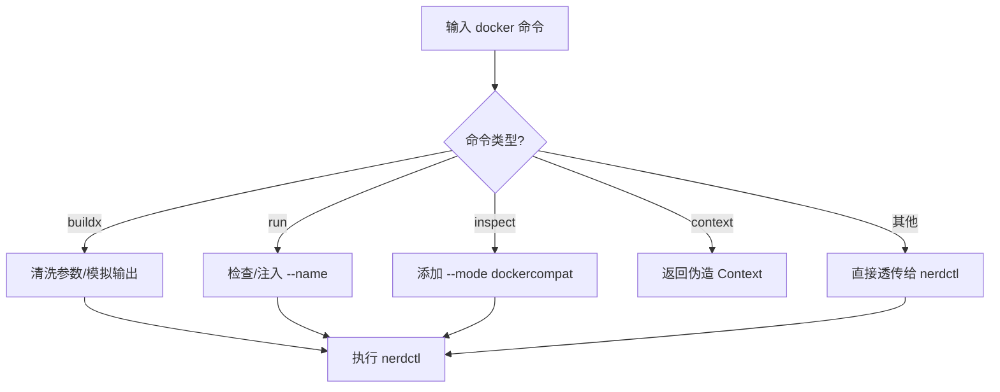

# nerdctl-docker-shim

一个基于 `nerdctl` 的 Docker CLI 兼容性包装脚本。

该脚本旨在为习惯使用 Docker CLI 或依赖 Docker CLI 的工具（如 VS Code Dev Containers, JetBrains IDEs 等）提供 `nerdctl` (containerd) 的无缝体验。它通过拦截 `docker` 命令并将其转换为对应的 `nerdctl` 命令来实现兼容。

## ✨ 功能特性

### 1. Buildx 构建支持

- **命令模拟**: 支持 `docker buildx version` 和 `docker buildx inspect`，欺骗 IDE 认为 Buildx 已就绪。
- **参数清洗**: 自动过滤 `nerdctl` 暂不支持的参数，防止构建失败：
  - `--builder`
  - `--load`
  - `--push`
  - `--provenance`
  - `--sbom`
- **日志优化**: 强制使用 `--progress=plain`，确保构建日志能被 IDE 正确捕获和显示。
- **输出模拟**: 构建完成后，模拟 Docker 的标准输出（如 `naming to ... done`, `Loaded image: ...`），确保工具能正确解析镜像 ID。

### 2. 容器运行增强

- **自动命名**: 当执行 `docker run` 未指定 `--name` 时，自动注入 `vsc-docker-<timestamp>` 格式的名称。这对于某些需要容器名称进行管理的 IDE 插件非常有用。

### 3. 兼容性修正

- **Inspect 模式**: 执行 `docker inspect` 时自动添加 `--mode dockercompat` 参数，确保返回的 JSON 格式与 Docker API 保持一致。
- **Context 模拟**: 支持 `docker context ls` 和 `docker context use`，伪造一个 `default` 上下文，满足工具检查需求。
- **Compose 支持**: 直接将 `docker compose` 命令转发给 `nerdctl compose`。
- **强制删除**: `docker rm -f` 直接转发。

### 4. 调试与日志

- **操作日志**: 所有的命令调用和转换细节默认记录在 `/tmp/nerdctl-docker-shim.log`，方便排查问题。

## ⚙️ 配置

你可以通过设置环境变量来调整脚本的行为：

| 环境变量            | 默认值                         | 说明                                  |
| :------------------ | :----------------------------- | :------------------------------------ |
| `NERDCTL_BIN`       | `nerdctl` (自动查找)           | 指定 `nerdctl` 二进制文件的实际路径。 |
| `NERDCTL_NAMESPACE` | `default`                      | 指定使用的 containerd 命名空间。      |
| `DOCKER_SHIM_LOG`   | `/tmp/nerdctl-docker-shim.log` | 指定日志文件的输出路径。              |

## 📦 安装使用

### ⚠️ 重要提示：防止覆盖

如果你的系统中已经安装了 Docker，建议先备份原始的二进制文件，以免发生冲突或意外覆盖。

```bash
# 查找现有的 docker 命令位置
which docker

# 备份（假设在 /usr/bin/docker）
sudo mv /usr/bin/docker /usr/bin/docker.real
```

### 安装步骤

1. **下载脚本**

   ```bash
   curl -o docker https://raw.githubusercontent.com/kiddingbaby/nerdctl-docker-shim/main/docker
   chmod +x docker
   ```

1. **安装到系统路径**

   将脚本移动到 `PATH` 中的目录（如 `/usr/local/bin` 或 `/usr/bin`）。确保该目录在 `PATH` 中的优先级足够高，或者你已经移除了原有的 `docker` 命令。

   ```bash
   sudo mv docker /usr/local/bin/docker
   ```

1. **验证安装**

   ```bash
   # 确认 docker 命令现在指向 shim 脚本
   ls -l $(which docker)

   # 验证功能 (应该显示 nerdctl 的版本信息)
   docker version
   ```

### 🔧 关于 `nerdctl` 的关联设置

本脚本的核心作用就是将 `docker` 命令“转发”给 `nerdctl`。为了确保转发正常工作：

1. **确保 `nerdctl` 已安装**: 脚本默认会在 `PATH` 中查找 `nerdctl`。
2. **自定义路径**: 如果 `nerdctl` 不在 `PATH` 中，或者你想指定特定的二进制文件，请设置环境变量：

   ```bash
   export NERDCTL_BIN=/path/to/your/nerdctl
   ```

## 🧪 测试

本项目包含两类测试：

1. **单元测试** (`tests/unit_test.sh`): 模拟 `nerdctl`，验证参数解析和逻辑转换。无需真实容器环境。
2. **集成测试** (`tests/integration_test.sh`): 需要真实的 `nerdctl` 环境，模拟 VS Code 的完整构建和运行流程。
3. **Dev Container 模拟** (`tests/simulate_devcontainer.sh`): 使用真实的 `.devcontainer` 配置进行端到端测试，还原 VS Code 行为。

```bash
# 运行单元测试
bash tests/unit_test.sh

# 运行集成测试
bash tests/integration_test.sh

# 运行 Dev Container 模拟
bash tests/simulate_devcontainer.sh
```

## 📝 脚本逻辑概览


