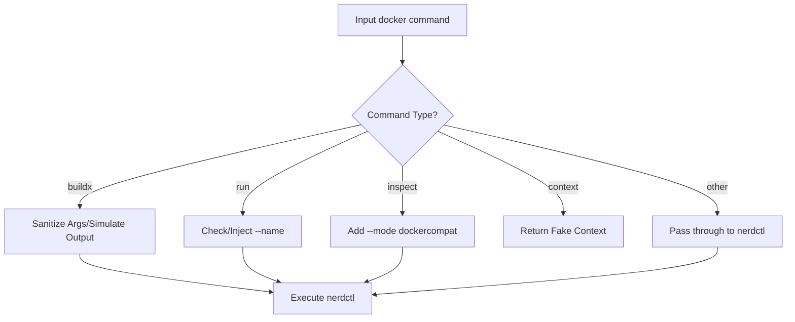

# nerdctl-docker-shim

[中文版](README_zh-CN.md)

A Docker CLI compatibility wrapper script based on `nerdctl`.

This script aims to provide a seamless `nerdctl` (containerd) experience for tools that are accustomed to using the Docker CLI or depend on it (such as VS Code Dev Containers, JetBrains IDEs, etc.). It achieves compatibility by intercepting `docker` commands and converting them into corresponding `nerdctl` commands.

## ✨ Features

### 1. Buildx Build Support

- **Command Simulation**: Supports `docker buildx version` and `docker buildx inspect`, tricking IDEs into believing Buildx is ready.
- **Argument Sanitization**: Automatically filters out arguments not yet supported by `nerdctl` to prevent build failures:
  - `--builder`
  - `--load`
  - `--push`
  - `--provenance`
  - `--sbom`
- **Log Optimization**: Forces the use of `--progress=plain` to ensure build logs are correctly captured and displayed by IDEs.
- **Output Simulation**: After the build completes, simulates Docker's standard output (e.g., `naming to ... done`, `Loaded image: ...`) to ensure tools can correctly parse the image ID.

### 2. Container Run Enhancements

- **Auto Naming**: When `docker run` is executed without specifying `--name`, automatically injects a name in the format `vsc-docker-<timestamp>`. This is very useful for certain IDE plugins that require container names for management.

### 3. Compatibility Fixes

- **Inspect Mode**: Automatically adds the `--mode dockercompat` argument when executing `docker inspect`, ensuring the returned JSON format is consistent with the Docker API.
- **Context Simulation**: Supports `docker context ls` and `docker context use`, faking a `default` context to satisfy tool check requirements.
- **Compose Support**: Directly forwards `docker compose` commands to `nerdctl compose`.
- **Force Remove**: `docker rm -f` is directly forwarded.

### 4. Debugging & Logging

- **Operation Logs**: All command calls and conversion details are logged by default in `/tmp/nerdctl-docker-shim.log` for easy troubleshooting.

## ⚙️ Configuration

You can adjust the script's behavior by setting environment variables:

| Environment Variable | Default Value                  | Description                                        |
| :------------------- | :----------------------------- | :------------------------------------------------- |
| `NERDCTL_BIN`        | `nerdctl` (auto-detected)      | Specifies the actual path to the `nerdctl` binary. |
| `NERDCTL_NAMESPACE`  | `default`                      | Specifies the containerd namespace to use.         |
| `DOCKER_SHIM_LOG`    | `/tmp/nerdctl-docker-shim.log` | Specifies the output path for the log file.        |

## 📦 Installation & Usage

### ⚠️ Important: Prevent Overwriting

If Docker is already installed on your system, it is recommended to back up the original binary first to avoid conflicts or accidental overwrites.

```bash
# Find the location of the existing docker command
which docker

# Backup (assuming it is at /usr/bin/docker)
sudo mv /usr/bin/docker /usr/bin/docker.real
```

### Installation Steps

1. **Download the Script**

   ```bash
   curl -o docker https://raw.githubusercontent.com/kiddingbaby/nerdctl-docker-shim/main/docker
   chmod +x docker
   ```

1. **Install to System Path**

   Move the script to a directory in your `PATH` (e.g., `/usr/local/bin` or `/usr/bin`). Ensure this directory has high enough priority in your `PATH`, or that you have removed the original `docker` command.

   ```bash
   sudo mv docker /usr/local/bin/docker
   ```

1. **Verify Installation**

   ```bash
   # Confirm the docker command now points to the shim script
   ls -l $(which docker)

   # Verify functionality (should display nerdctl version info)
   docker version
   ```

### 🔧 Related Settings for `nerdctl`

The core function of this script is to "forward" `docker` commands to `nerdctl`. To ensure forwarding works correctly:

1. **Ensure `nerdctl` is installed**: The script defaults to looking for `nerdctl` in your `PATH`.
2. **Custom Path**: If `nerdctl` is not in your `PATH`, or you want to specify a specific binary, please set the environment variable:

   ```bash
   export NERDCTL_BIN=/path/to/your/nerdctl
   ```

## 🧪 Testing

This project includes two types of tests:

1. **Unit Tests** (`tests/unit_test.sh`): Mocks `nerdctl` to verify argument parsing and logic conversion. No real container environment required.
2. **Integration Tests** (`tests/integration_test.sh`): Requires a real `nerdctl` environment to simulate the complete VS Code build and run flow.
3. **Dev Container Simulation** (`tests/simulate_devcontainer.sh`): Uses real `.devcontainer` configuration for end-to-end testing, replicating VS Code behavior.

```bash
# Run unit tests
bash tests/unit_test.sh

# Run integration tests
bash tests/integration_test.sh

# Run Dev Container simulation
bash tests/simulate_devcontainer.sh
```

## 📝 Script Logic Overview


