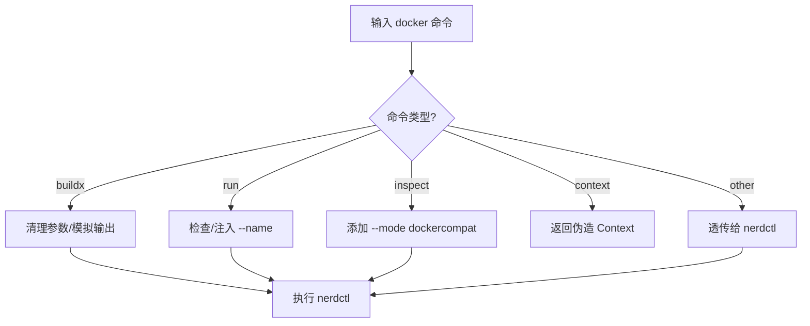

# nerdctl-docker-shim

[English](README.md)

一个基于 `nerdctl` 的 Docker CLI 兼容性包装脚本。

此脚本旨在为习惯使用 Docker CLI 或依赖它的工具（如 VS Code Dev Containers、JetBrains IDE 等）提供无缝的 `nerdctl` (containerd) 体验。它通过拦截 `docker` 命令并将其转换为相应的 `nerdctl` 命令来实现兼容性。

## ✨ 功能特性

### 1. Buildx 构建支持

- **命令模拟**：支持 `docker buildx version` 和 `docker buildx inspect`，欺骗 IDE 认为 Buildx 已就绪。
- **参数清理**：自动过滤掉 `nerdctl` 尚未支持的参数，防止构建失败：
  - `--builder`
  - `--load`
  - `--push`
  - `--provenance`
  - `--sbom`
- **日志优化**：强制使用 `--progress=plain`，确保构建日志能被 IDE 正确捕获和显示。
- **输出模拟**：构建完成后，模拟 Docker 的标准输出（例如 `naming to ... done`, `Loaded image: ...`），确保工具能正确解析镜像 ID。

### 2. 容器运行增强

- **自动命名**：当执行 `docker run` 未指定 `--name` 时，自动注入格式为 `vsc-docker-<timestamp>` 的名称。这对某些需要容器名称进行管理的 IDE 插件非常有用。

### 3. 兼容性修复

- **Inspect 模式**：执行 `docker inspect` 时自动添加 `--mode dockercompat` 参数，确保返回的 JSON 格式与 Docker API 一致。
- **Context 模拟**：支持 `docker context ls` 和 `docker context use`，伪造一个 `default` 上下文以满足工具检查要求。
- **Compose 支持**：直接将 `docker compose` 命令转发给 `nerdctl compose`。
- **强制删除**：直接转发 `docker rm -f`。

### 4. 调试与日志

- **操作日志**：所有命令调用和转换细节默认记录在 `/tmp/nerdctl-docker-shim.log` 中，便于故障排查。

## ⚙️ 配置

你可以通过设置环境变量来调整脚本的行为：

| 环境变量            | 默认值                         | 描述                                  |
| :------------------ | :----------------------------- | :------------------------------------ |
| `NERDCTL_BIN`       | `nerdctl` (自动检测)           | 指定 `nerdctl` 二进制文件的实际路径。 |
| `NERDCTL_NAMESPACE` | `default`                      | 指定使用的 containerd 命名空间。      |
| `DOCKER_SHIM_LOG`   | `/tmp/nerdctl-docker-shim.log` | 指定日志文件的输出路径。              |

## 📦 安装与使用

### ⚠️ 重要：防止覆盖

如果你的系统上已经安装了 Docker，建议先备份原始二进制文件，以避免冲突或意外覆盖。

```bash
# 查找现有 docker 命令的位置
which docker

# 备份（假设它在 /usr/bin/docker）
sudo mv /usr/bin/docker /usr/bin/docker.real
```

### 安装步骤

1. **下载脚本**

   ```bash
   curl -o docker https://raw.githubusercontent.com/kiddingbaby/nerdctl-docker-shim/main/docker
   chmod +x docker
   ```

1. **安装到系统路径**

   将脚本移动到你的 `PATH` 中的目录（例如 `/usr/local/bin` 或 `/usr/bin`）。确保此目录在你的 `PATH` 中具有足够高的优先级，或者你已经移除了原始的 `docker` 命令。

   ```bash
   sudo mv docker /usr/local/bin/docker
   ```

1. **验证安装**

   ```bash
   # 确认 docker 命令现在指向 shim 脚本
   ls -l $(which docker)

   # 验证功能（应显示 nerdctl 版本信息）
   docker version
   ```

### 🔧 `nerdctl` 相关设置

此脚本的核心功能是将 `docker` 命令“转发”给 `nerdctl`。为确保转发正常工作：

1. **确保已安装 `nerdctl`**：脚本默认在你的 `PATH` 中查找 `nerdctl`。
2. **自定义路径**：如果 `nerdctl` 不在你的 `PATH` 中，或者你想指定特定的二进制文件，请设置环境变量：

   ```bash
   export NERDCTL_BIN=/path/to/your/nerdctl
   ```

## 🧪 测试

本项目包含两种类型的测试：

1. **单元测试** (`tests/unit_test.sh`)：Mock `nerdctl` 以验证参数解析和逻辑转换。不需要真实的容器环境。
2. **集成测试** (`tests/integration_test.sh`)：需要真实的 `nerdctl` 环境来模拟完整的 VS Code 构建和运行流程。
3. **Dev Container 模拟** (`tests/simulate_devcontainer.sh`)：使用真实的 `.devcontainer` 配置进行端到端测试，复制 VS Code 的行为。

```bash
# 运行单元测试
bash tests/unit_test.sh

# 运行集成测试
bash tests/integration_test.sh

# 运行 Dev Container 模拟
bash tests/simulate_devcontainer.sh
```

## 📝 脚本逻辑概览


